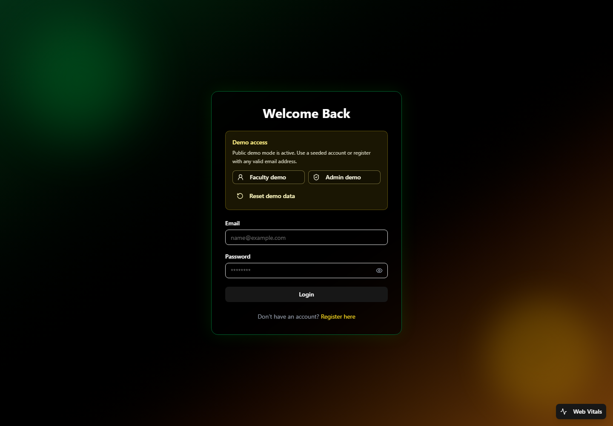
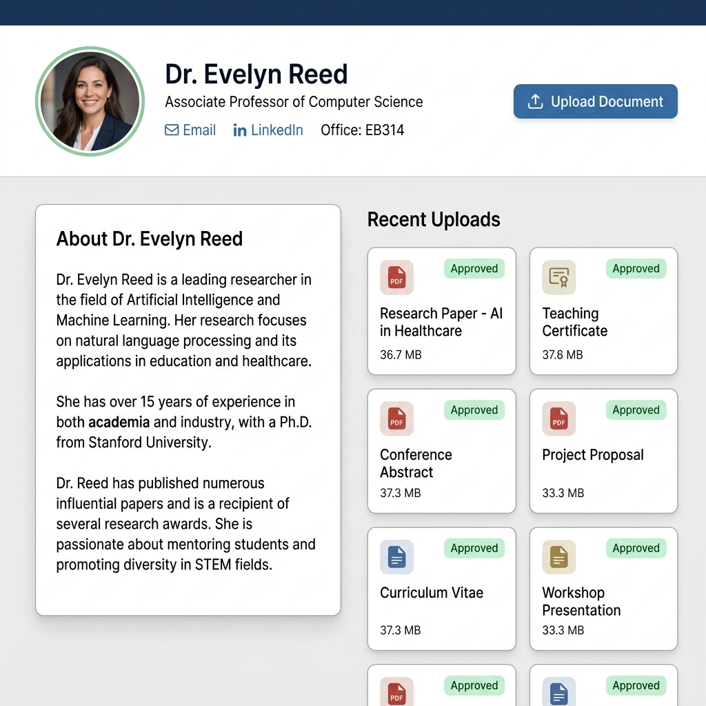
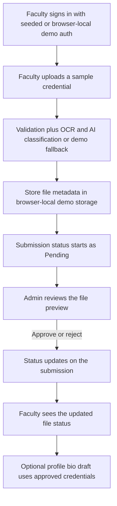
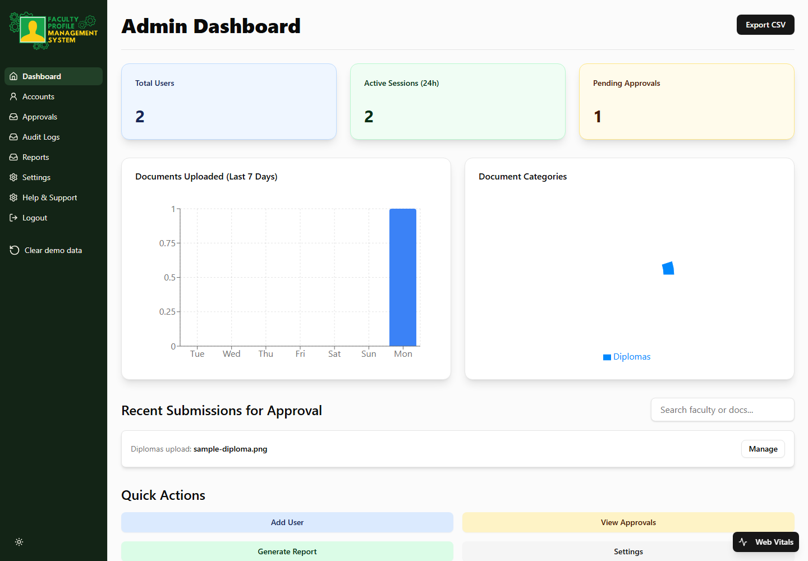

<div align="center">

# 🎓 7th CCIS Hackathon Smart Profile Management System
**Restored public demo for faculty credential uploads, admin review, and profile building**

[](https://vitejs.dev/)
[](https://www.typescriptlang.org/)
[](https://tailwindcss.com/)
[](https://openai.com/)
[](https://playwright.dev/)

</div>

---

## 🌟 Restoration Status
This repository contains the source code for the original 7th CCIS Hackathon entry. It has been restored so a developer can install it from a clean clone, run it locally, build it, and demonstrate the main faculty/admin credential workflow without needing private backend or OpenAI credentials.

Public showcase URL: https://iron-mark.github.io/Hackathon-Smart-Profile-Management-System/

Release checkpoint: [`v2.1.1`](https://github.com/Iron-Mark/Hackathon-Smart-Profile-Management-System/releases/tag/v2.1.1)

Release status: [`docs/release-status.md`](docs/release-status.md)

The public build is intentionally demo-only. It uses seeded reviewer accounts, browser-local demo storage, generated sample files, and deterministic AI/OCR fallbacks when private API keys are not configured. There is no supported hosted persistence path in this showcase branch.

<div align="center">
  
  <br>
  <em>Current GitHub Pages login screen with seeded reviewer shortcuts.</em>
</div>

---

## 🚀 Key Features

### 🧠 Smart Upload Demo Pipeline
Faculty users can upload sample credential files from the dashboard. The restored demo validates file type and size, classifies the document, stores the submission, and keeps the flow usable even when private OCR or OpenAI services are unavailable.

### 🛡️ Role-Based Demo Routing
Administrators and faculty users are routed into separate app areas. The React `ProtectedRoute` layer checks the signed-in account role from browser-local demo state.

### 📊 Admin Review Dashboard
Admins can review pending credential submissions, open the demo file preview, and approve or reject uploads. Faculty users can then see the updated status in their uploaded files view.

### ✍️ Profile Builder And Bio Drafting
The faculty profile screen supports editable professional details, document-assisted autofill, and a biography draft action based on approved credentials. In public demo mode, the feature uses safe fallback behavior unless an API key is configured locally.

<div align="center">
  
  <br>
  <em>Current faculty profile screen from the restored public demo.</em>
</div>

---

## 🏗️ Architecture & Engineering

The restored project keeps the original React, Vite, OCR, and OpenAI-assisted product direction while making the public showcase reliable without private services. The demo backend stores seeded accounts, submissions, audit logs, and file metadata in browser-local storage. Uploaded files are demo-local and are not sent to a hosted document store.

### The AI End-to-End Flow



<br>

<div align="center">
  
  <br>
  <em>Current admin dashboard with seeded public demo data.</em>
</div>

---

## 💻 Running Locally

### Requirements

- Node.js 20 or newer
- npm 11 or newer

### Demo Mode Quick Start

Demo mode is the only supported runtime path. It uses local browser storage with seeded accounts, profile data, submissions, audit logs, and storage metadata.

```bash
npm ci
copy .env.example .env.local
npm run dev
```

Open the local Vite URL, usually `http://localhost:5173`.

Demo credentials:

- Faculty: `faculty@umak.edu.ph` / `Faculty123`
- Admin: `admin@umak.edu.ph` / `Admin123`
- Additional seeded faculty examples for admin review data: `daniel.reyes@umak.edu.ph` / `Faculty123` and `liza.mercado@umak.edu.ph` / `Faculty123`

The landing page includes a Start demo button that opens the login screen with seeded faculty credentials prefilled. It also links to generated sample credential files in `public/demo-samples`.

The login screen includes quick-fill buttons for both seeded accounts. The login and registration screens also include a Reset demo data button for clearing stale browser-local demo state.

Main demo flow:

1. Log in as the faculty user.
2. Confirm the upload area warns visitors to use sample files only, then upload a demo credential from the faculty dashboard.
3. Log in as the admin user.
4. Open Approvals, select View, and confirm the demo preview opens for the uploaded file.
5. Approve the uploaded credential.
6. Log back in as faculty, confirm the credential status is approved, and select View from the faculty file card.

Public visitors can also register with any valid email address in demo mode. Registration creates a local faculty account in that browser only. Do not upload sensitive real documents to a public showcase build; demo data is browser-local and meant for generated sample files. The included sample set covers certificate, transcript, diploma, CV, and research summary records.

For a concise showcase script, see `docs/demo-checklist.md`.
For public reviewer notes, see `docs/PUBLIC_DEMO.md`.
For demo backend limitations, see `docs/demo-backend.md`.
For optional Clerk identity and Organization controls, see `docs/clerk-showcase-auth.md`.
For the verified release checkpoint and current release gate, see `docs/release-status.md`.
The README screenshots are maintained in `docs/images/login.png`, `docs/images/profile.png`, and `docs/images/dashboard.png`.

### Performance And Web Vitals

Route screens are lazy-loaded so the landing/auth experience does not load every admin and faculty page up front. Demo mode also shows a local Web Vitals button and panel for LCP, INP, CLS, FCP, and TTFB. The button shows the live collected-metric count for the current browser session, and the panel uses the official `web-vitals` package without sending metrics to a backend.

### Demo-Only Backend

The app no longer supports a hosted backend setup path. `VITE_DEMO_MODE=true` remains in `.env.example` to make the public intent explicit, but the browser-local demo backend is always used.

`VITE_OPENAI_API_KEY` is optional for local restoration. If it is missing, AI classification and biography generation use mock/demo fallbacks. Do not use a browser-exposed OpenAI key for production without a server-side proxy.

### Optional Clerk Showcase Auth

Clerk can be enabled for sign-in, sign-up, profile menu, and Organization switching by adding a publishable key to `.env.local`:

```env
VITE_CLERK_PUBLISHABLE_KEY=pk_test_or_pk_live_value_here
```

This does not add a production backend. Clerk-authenticated visitors are mapped to a browser-local faculty demo account, and all profile, upload, submission, and approval data still stays in that browser. Admin access remains the seeded admin demo account because browser-side Organization state is not a trusted authorization source.

Helpful Clerk resources:

- React quickstart: https://clerk.com/docs/react/getting-started/quickstart
- Organizations: https://clerk.com/docs/guides/organizations/overview
- Components: https://clerk.com/docs/reference/components/overview
- Dashboard: https://dashboard.clerk.com/

### Verification Commands

```bash
npm ci
npm test -- --run
npm run lint
npm run security:scan
npm run seo:check
npm run links:check
npm run build
npx playwright test
```

To verify the built output with the same base path used by GitHub Pages, use the commands in `docs/demo-checklist.md`.
The `npm run preview:pages` helper serves `dist` under the repository base path so local QA matches GitHub Pages asset URLs.

### 🐋 Docker Optimization
The repository includes a multi-stage Dockerfile that builds the React project and serves the static output through NGINX.
```bash
docker build -t smart-profile-system .
docker run -p 80:80 smart-profile-system
```

### 🧪 Verifiable QA
This platform ships with Vitest component/unit coverage and Playwright end-to-end coverage for the restored demo workflow and RBAC smoke checks.
```bash
# Run ESLint validation
npm run lint

# Run Vitest
npm test -- --run

# Run headless Playwright End-to-End tests
npx playwright test
```

### Restoration Notes

- `npm ci` works without `--legacy-peer-deps`.
- The production build creates `dist/404.html` through a cross-platform Node script.
- `npm run seo:check` validates the GitHub Pages canonical URL, crawler files, answer-engine FAQ data, social preview metadata, and 1200x630 Open Graph image.
- Route-level code splitting keeps the public demo entry lighter than the full dashboard bundle.
- `npm run security:scan` checks source files for common private key and token patterns.
- Local and GitHub Pages demo mode preserve the 7th CCIS Hackathon workflow without requiring private accounts.
- The demo backend is local-only and is not production authentication, production authorization, or production document storage.

---

## 👤 About the Author

* **Sole maintainer:** Mark Siazon

## 👥 Past Initial Hackathon Team (Team 2nd Choice)

* **Mark Siazon** – Lead Frontend Developer & UI/UX
* **Charles Nathaniel Togle** – Backend & Integration
* **Alexa San Jose** – Systems & Architecture

<div align="center">
  <strong>Maintained by Mark Siazon. Original 7th CCIS Hackathon entry by Team 2nd Choice.</strong>
</div>
