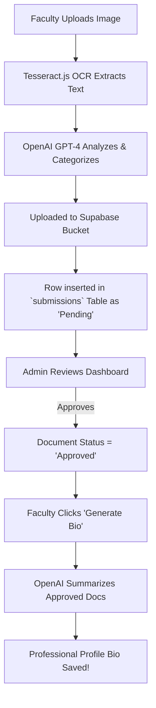

<div align="center">

# 🎓 Hackathon Smart Profile Management System
**The Intelligent End-to-End Credential Management Platform for Academia**

[](https://vitejs.dev/)
[](https://www.typescriptlang.org/)
[](https://tailwindcss.com/)
[](https://supabase.com/)
[](https://openai.com/)
[](https://playwright.dev/)

</div>

---

## 🌟 The Legacy & Revival
This repository contains the source code for our original UMak CCIS Hackathon entry, which has now been fully **revived and modernized** into a production-ready SaaS platform. We took the foundational hackathon code and engineered it into a deeply secure, and beautiful platform designed to permanently solve the chaos of scattered faculty spreadsheets and missing academic credentials.

By combining Optical Character Recognition (OCR), Generative AI (OpenAI), and Real-time Databases (Supabase), we created an ecosystem that categorizes, tracks, and audits faculty credentials entirely autonomously.

<div align="center">
  
  <br>
  <em>The beautifully crafted, glassmorphic Landing & Auth portal.</em>
</div>

---

## 🚀 Key Features

### 🧠 Intelligent AI Upload Pipeline
Upload a raw image of a diploma, CV, or certificate. The platform extracts the text via `Tesseract.js` (OCR) and feeds it to a custom `OpenAI` pipeline that automatically classifies the exact document type and inserts it into the database.

### 🛡️ Iron-Clad Role-Based Security (RBAC)
Administrators and Faculty operate in strictly segregated environments. Our `ProtectedRoute` routing layer constantly validates incoming navigation against real-time Supabase Auth credentials to ensure flawless access control.

### 📊 Real-Time Admin Dashboards
Admins are equipped with a live Recharts analytics dashboard detailing the inflow of documents. Approving or Rejecting a document instantly pushes that status update back to the specific Faculty member's view.

### ✍️ AI-Powered Biography Generation
The crown jewel of the Smart System. With a single click, the platform gathers all of a Faculty member's verified, *Approved* credentials and commands the AI to ghostwrite a stellar, professional biography directly into their profile.

<div align="center">
  
  <br>
  <em>Faculty Profile demonstrating the AI-generated bio and approved credentials.</em>
</div>

---

## 🏗️ Architecture & Engineering

The platform is designed to be fully containerized and production-ready from day one.

### The AI End-to-End Flow



<br>

<div align="center">
  
  <br>
  <em>The sophisticated Admin Analytics & Approval Dashboard.</em>
</div>

---

## 💻 Running the Ecosystem

> [!IMPORTANT]
> To run the backend features, you must duplicate `.env.example` into `.env.local` and inject your active Supabase and OpenAI API credentials.

### Standard Execution
```bash
# Install all dependencies
npm install

# Start the Vite development server
npm run dev

# Compile TypeScript and build production bundle
npm run build
```

### 🐋 Docker Optimization
The application is pre-configured with a multi-stage Dockerfile that builds the React project and serves it through an ultra-lightweight NGINX container.
```bash
docker build -t smart-profile-system .
docker run -p 80:80 smart-profile-system
```

### 🧪 Verifiable QA
This platform ships with a robust Playwright End-to-End testing suite to permanently guarantee the RBAC security models never regress.
```bash
# Run ESLint validation
npm run lint

# Run headless Playwright End-to-End tests
npx playwright test
```

---

## 👥 Meet the Team (Team 2nd Choice)

* **Mark Siazon** – Lead Frontend Developer & UI/UX
* **Charles Nathaniel Togle** – Backend & Integration
* **Alexa San Jose** – Systems & Architecture

<div align="center">
  <strong>Built with ❤️ by Team 2nd Choice for the UMak CCIS Hackathon</strong>
</div>
