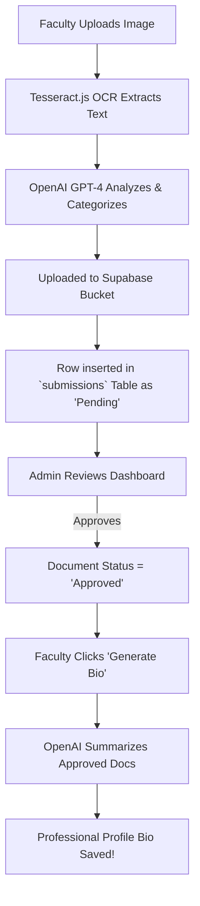

<div align="center">

# 🎓 Hackathon Smart Profile Management System
**The Intelligent End-to-End Credential Management Platform for Academia**

[](https://vitejs.dev/)
[](https://www.typescriptlang.org/)
[](https://tailwindcss.com/)
[](https://supabase.com/)
[](https://openai.com/)
[](https://playwright.dev/)

</div>

---

## 🌟 Restoration Status
This repository contains the source code for the original UMak CCIS Hackathon entry. It has been restored so a developer can install it from a clean clone, run it locally, build it, and demonstrate the main faculty/admin credential workflow without needing private Supabase or OpenAI credentials.

Public showcase URL: https://iron-mark.github.io/Hackathon-Smart-Profile-Management-System/

By combining Optical Character Recognition (OCR), Generative AI (OpenAI), and Real-time Databases (Supabase), we created an ecosystem that categorizes, tracks, and audits faculty credentials entirely autonomously.

<div align="center">
  
  <br>
  <em>The beautifully crafted, glassmorphic Landing & Auth portal.</em>
</div>

---

## 🚀 Key Features

### 🧠 Intelligent AI Upload Pipeline
Upload a raw image of a diploma, CV, or certificate. The platform extracts the text via `Tesseract.js` (OCR) and feeds it to a custom `OpenAI` pipeline that automatically classifies the exact document type and inserts it into the database.

### 🛡️ Iron-Clad Role-Based Security (RBAC)
Administrators and Faculty operate in strictly segregated environments. Our `ProtectedRoute` routing layer constantly validates incoming navigation against real-time Supabase Auth credentials to ensure flawless access control.

### 📊 Real-Time Admin Dashboards
Admins are equipped with a live Recharts analytics dashboard detailing the inflow of documents. Approving or Rejecting a document instantly pushes that status update back to the specific Faculty member's view.

### ✍️ AI-Powered Biography Generation
The crown jewel of the Smart System. With a single click, the platform gathers all of a Faculty member's verified, *Approved* credentials and commands the AI to ghostwrite a stellar, professional biography directly into their profile.

<div align="center">
  
  <br>
  <em>Faculty Profile demonstrating the AI-generated bio and approved credentials.</em>
</div>

---

## 🏗️ Architecture & Engineering

The platform is designed to be fully containerized and production-ready from day one.

### The AI End-to-End Flow



<br>

<div align="center">
  
  <br>
  <em>The sophisticated Admin Analytics & Approval Dashboard.</em>
</div>

---

## 💻 Running Locally

### Requirements

- Node.js 20 or newer
- npm 11 or newer

### Demo Mode Quick Start

Demo mode is the default when Supabase credentials are missing. It uses local browser storage with seeded accounts, profile data, submissions, audit logs, and storage metadata.

```bash
npm ci
copy .env.example .env.local
npm run dev
```

Open the local Vite URL, usually `http://localhost:5173`.

Demo credentials:

- Faculty: `faculty@umak.edu.ph` / `Faculty123`
- Admin: `admin@umak.edu.ph` / `Admin123`

The landing page includes a Start demo button that opens the login screen with seeded faculty credentials prefilled. It also links to generated sample credential files in `public/demo-samples`.

The login screen includes quick-fill buttons for both seeded accounts. The login and registration screens also include a Reset demo data button for clearing stale browser-local demo state.

Main demo flow:

1. Log in as the faculty user.
2. Confirm the upload area warns visitors to use sample files only, then upload a demo credential from the faculty dashboard.
3. Log in as the admin user.
4. Open Approvals, select View, and confirm the demo preview opens for the uploaded file.
5. Approve the uploaded credential.
6. Log back in as faculty, confirm the credential status is approved, and select View from the faculty file card.

Public visitors can also register with any valid email address in demo mode. Registration creates a local faculty account in that browser only. Do not upload sensitive real documents to a public showcase build; demo data is browser-local and meant for sample files.

For a concise showcase script, see `docs/demo-checklist.md`.
For public reviewer notes, see `PUBLIC_DEMO.md`.

### Performance And Web Vitals

Route screens are lazy-loaded so the landing/auth experience does not load every admin and faculty page up front. Demo mode also shows a local Web Vitals panel for LCP, INP, CLS, FCP, and TTFB. The panel uses the official `web-vitals` package and does not send metrics to a backend.

### Real Supabase Backend Mode

Set `VITE_DEMO_MODE=false` in `.env.local`, then provide:

```bash
VITE_SUPABASE_URL=...
VITE_SUPABASE_ANON_KEY=...
VITE_OPENAI_API_KEY=...
```

Supabase setup expectations:

- Apply the table bootstrap from `supabase_schema.sql`, then the storage/RLS guidance from `supabase_rls_policies.sql`.
- See `docs/supabase-setup.md` for the expected apply order and production caveats.
- Create a private `pictures-and-documents` storage bucket.
- Ensure the expected tables exist: `account_details`, `profile_details`, `educational_background`, `work_experiences`, `professional_development`, `submissions`, and `audit_logs`.

`VITE_OPENAI_API_KEY` is optional for local restoration. If it is missing, AI classification and biography generation use mock/demo fallbacks. Do not use a browser-exposed OpenAI key for production without a server-side proxy.

### Verification Commands

```bash
npm ci
npm test -- --run
npm run lint
npm run security:scan
npm run seo:check
npm run links:check
npm run build
npx playwright test
```

To verify the built output with the same base path used by GitHub Pages, use the commands in `docs/demo-checklist.md`.
The `npm run preview:pages` helper serves `dist` under the repository base path so local QA matches GitHub Pages asset URLs.

### 🐋 Docker Optimization
The application is pre-configured with a multi-stage Dockerfile that builds the React project and serves it through an ultra-lightweight NGINX container.
```bash
docker build -t smart-profile-system .
docker run -p 80:80 smart-profile-system
```

### 🧪 Verifiable QA
This platform ships with Vitest component/unit coverage and Playwright end-to-end coverage for the restored demo workflow and RBAC smoke checks.
```bash
# Run ESLint validation
npm run lint

# Run Vitest
npm test -- --run

# Run headless Playwright End-to-End tests
npx playwright test
```

### Restoration Notes

- `npm ci` works without `--legacy-peer-deps`.
- The production build creates `dist/404.html` through a cross-platform Node script.
- `npm run seo:check` validates the GitHub Pages canonical URL, crawler files, answer-engine FAQ data, social preview metadata, and 1200x630 Open Graph image.
- Route-level code splitting keeps the public demo entry lighter than the full dashboard bundle.
- `npm run security:scan` checks source files for common private key and token patterns.
- Local and GitHub Pages demo mode preserve the hackathon workflow without requiring private accounts.
- Real Supabase mode is still supported when valid environment variables are provided.
- The demo backend is local-only and is not a production authentication or persistence layer.

---

## 👥 Meet the Team (Team 2nd Choice)

* **Mark Siazon** – Lead Frontend Developer & UI/UX
* **Charles Nathaniel Togle** – Backend & Integration
* **Alexa San Jose** – Systems & Architecture

<div align="center">
  <strong>Built with ❤️ by Team 2nd Choice for the UMak CCIS Hackathon</strong>
</div>
