<div align="center">
  

  <h1>CCIS Smart Faculty Profile Management System</h1>

  <p>
    A restored 7th CCIS Hackathon showcase for faculty credentials, admin review, and profile proofing.
    <br />
    Live in the browser. No backend required.
  </p>

  <p>
    <a href="https://iron-mark.github.io/Hackathon-Smart-Profile-Management-System/"><strong>Live demo</strong></a>
    ·
    <a href="docs/PUBLIC_DEMO.md">Public demo guide</a>
    ·
    <a href="docs/release-status.md">Release status</a>
  </p>

  <p>
    <a href="https://iron-mark.github.io/Hackathon-Smart-Profile-Management-System/"></a>
    <a href="https://vitejs.dev/"></a>
    <a href="https://www.typescriptlang.org/"></a>
    <a href="https://tailwindcss.com/"></a>
    <a href="https://playwright.dev/"></a>
  </p>
</div>

<p align="center">
  <a href="docs/media/demo.mp4">
    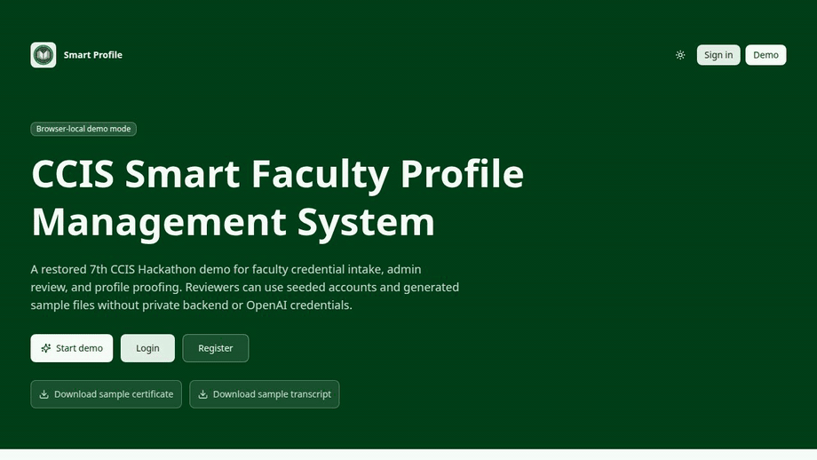
  </a>
</p>
<p align="center">
  <sub>
    Quick preview of how it works. Click for the silent
    <a href="docs/media/demo.mp4">full demo video</a> (MP4).
    GitHub README can loop GIFs but cannot autoplay video.
    Reuse these files from <a href="docs/media/README.md">docs/media</a> in later marketing.
  </sub>
</p>

---

## Try it in 60 seconds

Open the live GitHub Pages demo:

**https://iron-mark.github.io/Hackathon-Smart-Profile-Management-System/**

1. Select **Start demo** to prefill the faculty reviewer account.
2. Upload a generated sample credential from the faculty dashboard.
3. Sign in as admin, open **Approvals**, preview the file, and approve it.
4. Return as faculty and confirm the credential is approved.

| Role | Email | Password |
| :---: | --- | --- |
| Faculty | `faculty@umak.edu.ph` | `Faculty123` |
| Admin | `admin@umak.edu.ph` | `Admin123` |

Extra seeded faculty for the admin queue: `daniel.reyes@umak.edu.ph` and `liza.mercado@umak.edu.ph` (same faculty password).

This is a **browser-local public showcase**, not a production records system. Use the generated sample files only. Do not upload real IDs, transcripts, licenses, or private faculty documents.

<p align="center">
  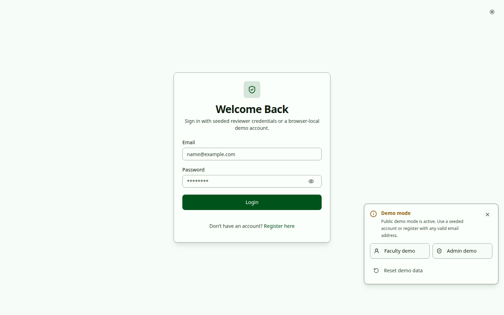
</p>
<p align="center"><sub>Seeded Faculty demo and Admin demo shortcuts. Register with any valid email for a browser-local faculty account.</sub></p>

---

## Feature clips

Looping GIFs for README, social posts, and later marketing. The silent MP4 walkthrough is [`docs/media/demo.mp4`](docs/media/demo.mp4). Usage notes live in [`docs/media/README.md`](docs/media/README.md).

<table>
  <tr>
    <td align="center" width="50%">
      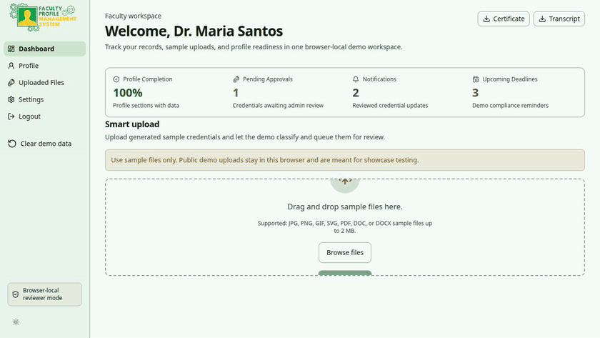
      <br />
      <sub>Smart upload</sub>
    </td>
    <td align="center" width="50%">
      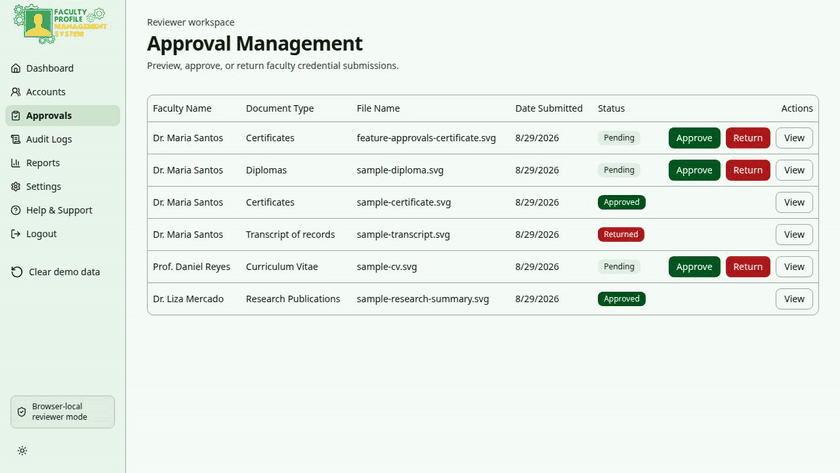
      <br />
      <sub>Admin approvals</sub>
    </td>
  </tr>
  <tr>
    <td align="center">
      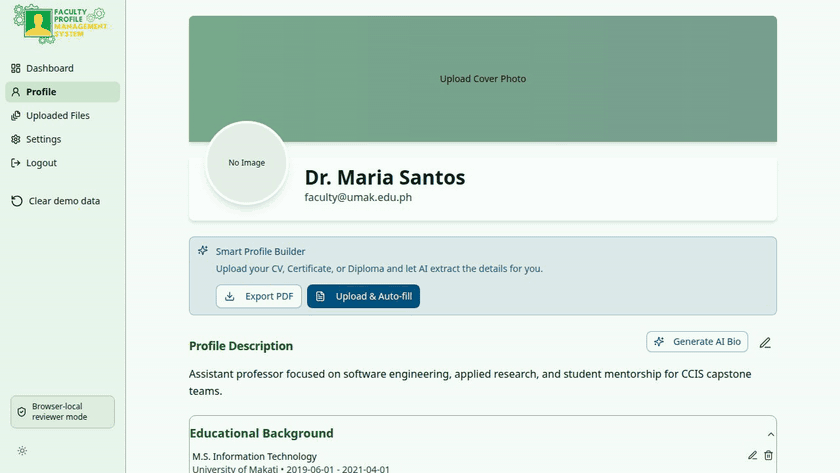
      <br />
      <sub>Profile AI bio</sub>
    </td>
    <td align="center">
      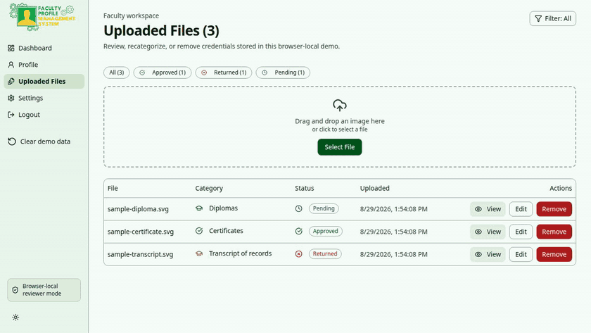
      <br />
      <sub>Uploaded files</sub>
    </td>
  </tr>
  <tr>
    <td align="center">
      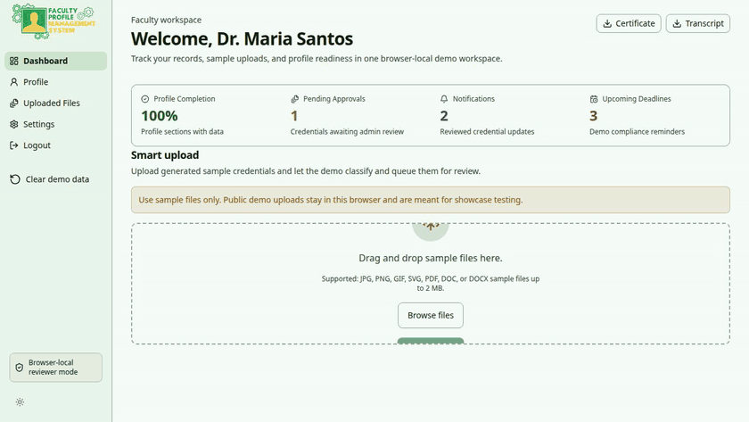
      <br />
      <sub>Light and dark theme</sub>
    </td>
    <td align="center">
      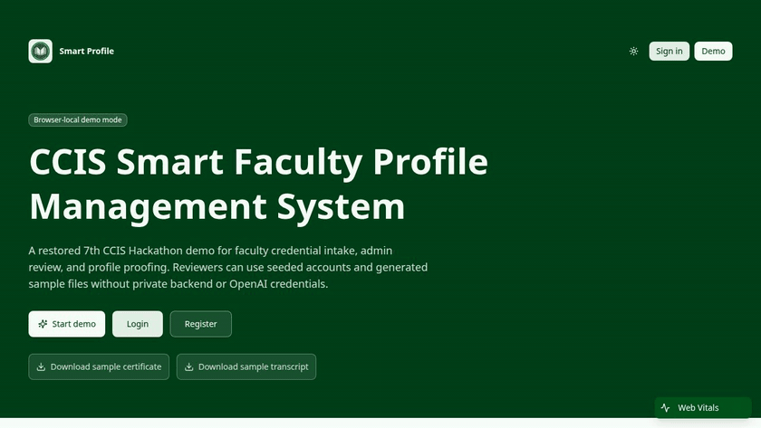
      <br />
      <sub>Web Vitals</sub>
    </td>
  </tr>
</table>

---

## Product stills

Light and dark mode share one CCIS green token system. The landing hero stays a dark branded band in both themes so the first impression does not invert to bright lime.

<table>
  <tr>
    <td align="center" width="50%">
      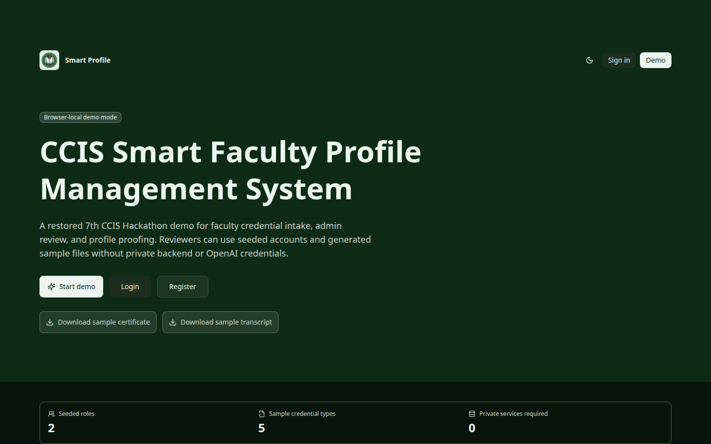
      <br />
      <sub>Landing · dark</sub>
    </td>
    <td align="center" width="50%">
      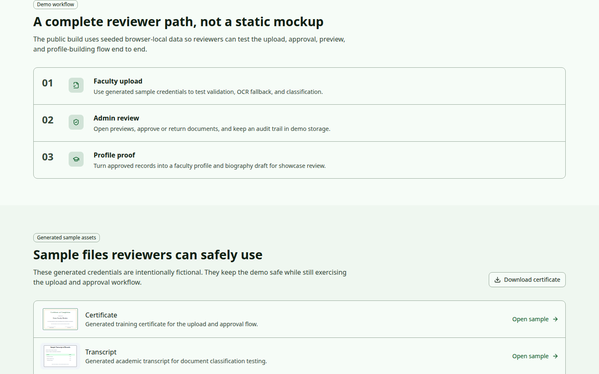
      <br />
      <sub>Workflow, samples, and facts</sub>
    </td>
  </tr>
  <tr>
    <td align="center">
      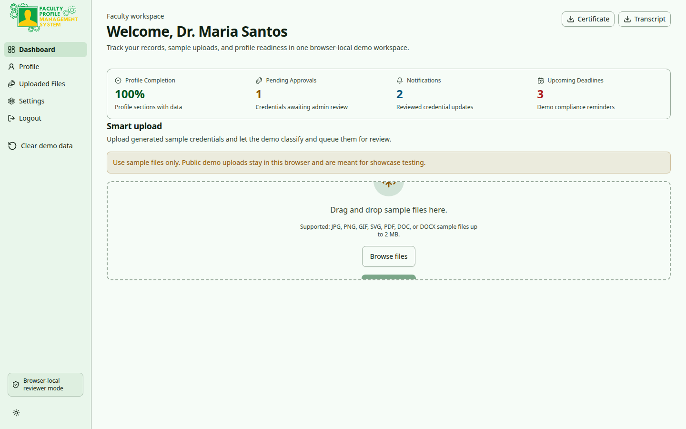
      <br />
      <sub>Faculty workspace · light</sub>
    </td>
    <td align="center">
      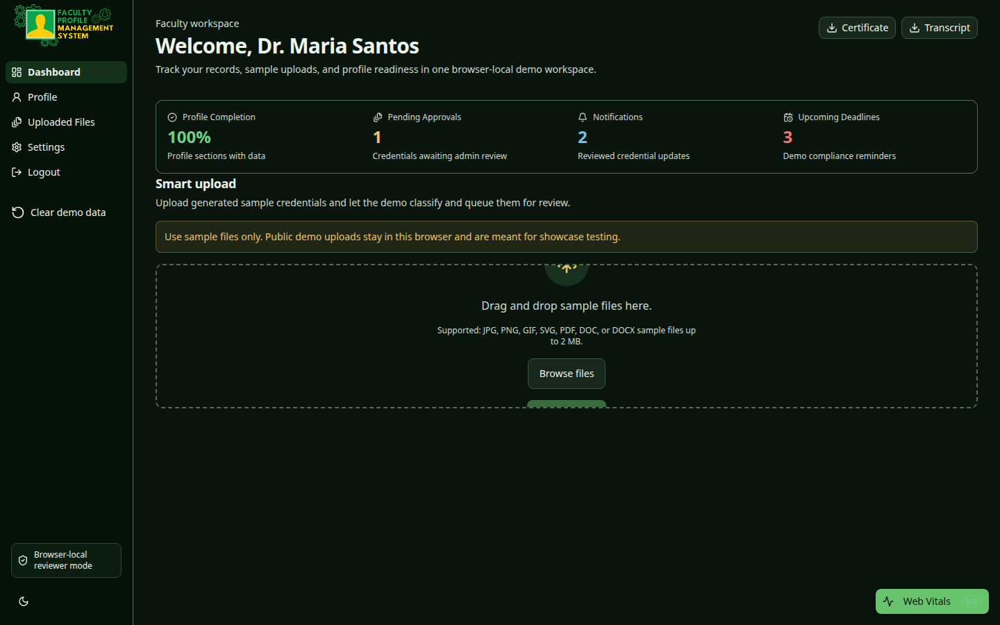
      <br />
      <sub>Faculty workspace · dark</sub>
    </td>
  </tr>
  <tr>
    <td align="center">
      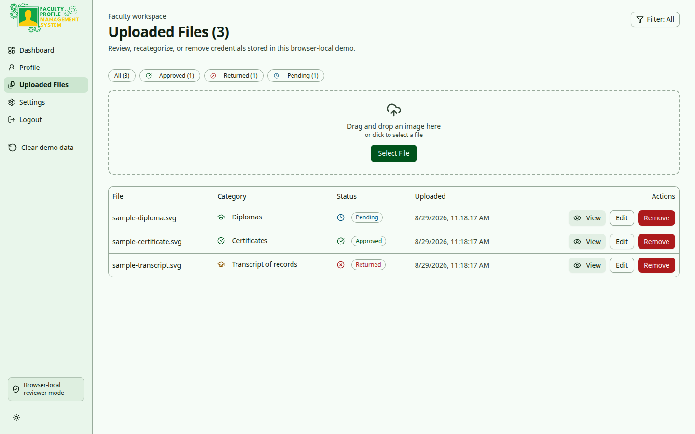
      <br />
      <sub>Uploaded files table</sub>
    </td>
    <td align="center">
      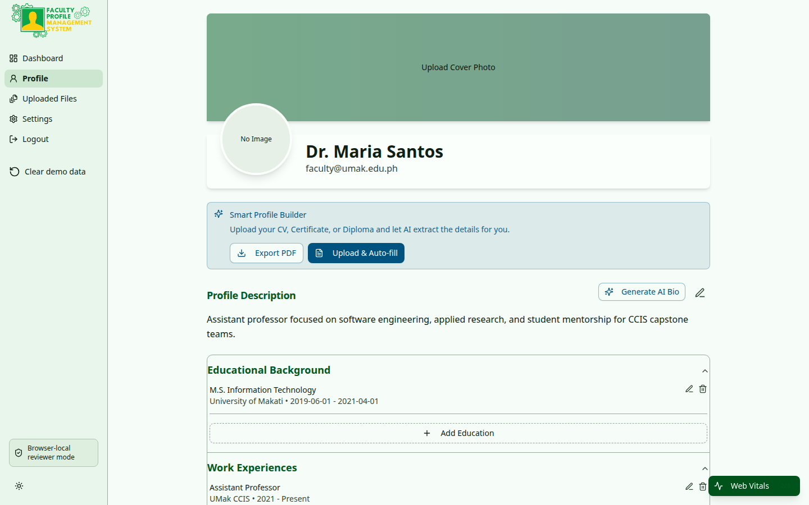
      <br />
      <sub>Profile builder</sub>
    </td>
  </tr>
  <tr>
    <td align="center">
      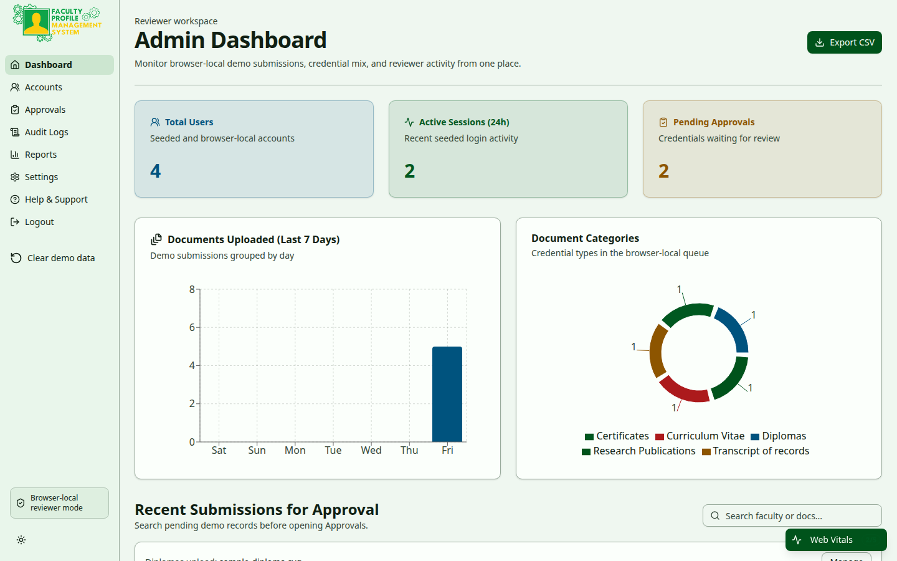
      <br />
      <sub>Admin dashboard</sub>
    </td>
    <td align="center">
      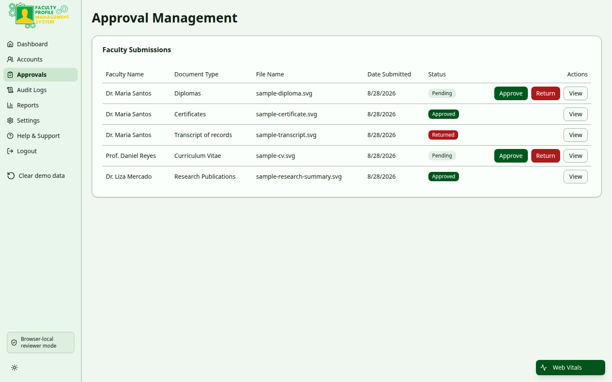
      <br />
      <sub>Approval queue</sub>
    </td>
  </tr>
</table>

<p align="center">
  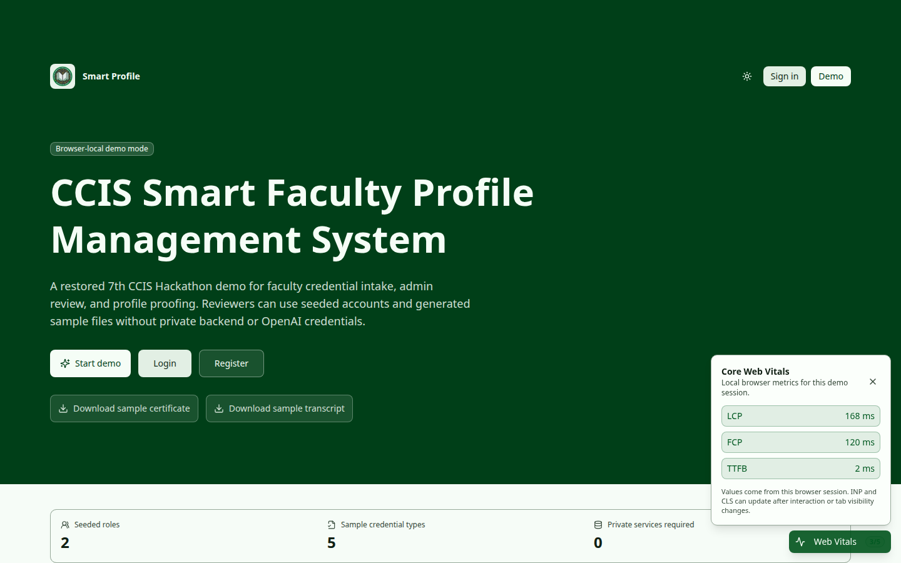
</p>
<p align="center"><sub>Local Core Web Vitals: LCP, INP, CLS, FCP, and TTFB stay in this browser. Nothing is sent anywhere.</sub></p>

Refresh captures after UI changes (`npm run dev` in another terminal):

```bash
npm run docs:screenshots
npm run docs:media
npm run docs:og
```

Stills go to `docs/images/`. GIFs and the demo MP4 go to `docs/media/`. Share cards (1200x630) go to `public/og-image.png` and `public/og/`. See [`docs/media/README.md`](docs/media/README.md).

---

## Why this demo exists

The original 7th CCIS Hackathon entry showed a faculty credential workflow: upload, classify, review, approve, then turn approved records into a professional profile. This repository restores that product path as a **portfolio-ready public demo**.

Reviewers can click through a complete loop without private backend accounts, storage buckets, or OpenAI keys. Seeded data, generated sample files, and deterministic AI/OCR fallbacks keep the story honest and runnable from a clean clone or GitHub Pages.

| Surface | What reviewers can try |
| --- | --- |
| Faculty intake | Validate sample files, classify the document type, and store a pending submission in this browser. |
| Admin review | Open a demo preview, approve or return the file, and leave an audit trail in local demo storage. |
| Profile proof | Edit professional details and draft a biography from approved credentials. |
| CCIS theme | Light mint surfaces and dark green-black chrome share one brand, with a public theme toggle. |
| Reviewer telemetry | Lower-right Web Vitals reports LCP, INP, CLS, FCP, and TTFB locally. |

Public checkpoint: [`v2.1.3`](https://github.com/Iron-Mark/Hackathon-Smart-Profile-Management-System/releases/tag/v2.1.3). Current release notes live in [`docs/release-status.md`](docs/release-status.md).

<details>
<summary>Pull-request CI policy</summary>

Pull-request CI is read-only and receives no repository secrets. Owners, collaborators, Dependabot, and Imgbot can be readied and queued for squash auto-merge only after all required checks succeed; other forks stay manual. Workflow dependencies are pinned to full commit SHAs. See [`.github/CI_SECURITY.md`](.github/CI_SECURITY.md).

</details>

---

## Key capabilities

**Smart upload pipeline.** Faculty users drop a sample credential on the dashboard. The demo checks type and size, classifies the document, stores the submission, and stays usable when OCR or OpenAI services are not configured.

**Role-based demo routing.** Administrators and faculty users land in separate app areas. `ProtectedRoute` reads the signed-in role from browser-local demo state.

**Admin review dashboard.** Admins review pending submissions, open the demo file preview, and approve or return uploads. Faculty users then see the updated status in Uploaded Files.

**Profile builder and bio drafting.** The faculty profile screen supports editable professional details, document-assisted autofill, and a biography draft action based on approved credentials. In public demo mode this uses safe fallbacks unless a local API key is set.

**Light and dark brand theme.** One CCIS green token system covers landing, auth, faculty, and admin chrome. Status chips use `success`, `warning`, and `info` tokens. The theme-color meta tag follows the active mode (`#f3faf4` light, `#102418` dark).

---

## Architecture

The restored project keeps the original React, Vite, OCR, and OpenAI-assisted product direction while making the public showcase reliable without private services. Seeded accounts, submissions, audit logs, and file metadata live in browser storage. Uploaded files stay demo-local and are not sent to a hosted document store.

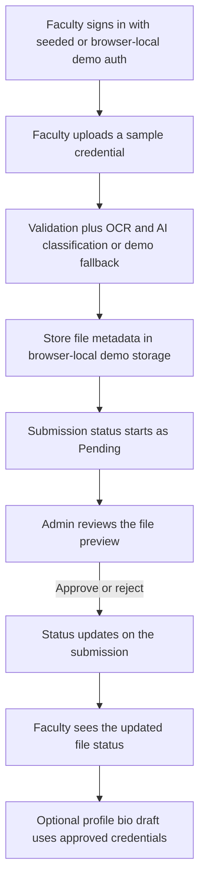
```mermaid
graph TD
    A[Faculty signs in with seeded or browser-local demo auth] --> B[Faculty uploads a sample credential]
    B --> C[Validation plus OCR and AI classification or demo fallback]
    C --> D[Store file metadata in browser-local demo storage]
    D --> E[Submission status starts as Pending]
    E --> F[Admin reviews the file preview]
    F -->|Approve or reject| G[Status updates on the submission]
    G --> H[Faculty sees the updated file status]
    H --> I[Optional profile bio draft uses approved credentials]
```

### Demo-only backend

The app does not support a hosted backend setup path. `VITE_DEMO_MODE=true` remains in `.env.example` to make that intent explicit, but the browser-local demo backend is always used.

`VITE_OPENAI_API_KEY` is optional for local restoration. If it is missing, AI classification and biography generation use mock/demo fallbacks. Do not use a browser-exposed OpenAI key for production without a server-side proxy.

### Optional Clerk showcase auth

Clerk can be enabled for sign-in, sign-up, profile menu, and Organization switching by adding a publishable key to `.env.local`:

```env
VITE_CLERK_PUBLISHABLE_KEY=pk_test_or_pk_live_value_here
```

This does not add a production backend. Clerk-authenticated visitors map to a browser-local faculty demo account. Admin access remains the seeded admin demo account because browser-side Organization state is not a trusted authorization source.

- React quickstart: https://clerk.com/docs/react/getting-started/quickstart
- Organizations: https://clerk.com/docs/guides/organizations/overview
- Components: https://clerk.com/docs/reference/components/overview
- Dashboard: https://dashboard.clerk.com/

---

## Run locally

### Requirements

- Node.js 20 or newer
- npm 11 or newer

### Quick start

```bash
npm ci
cp .env.example .env.local   # Windows: copy .env.example .env.local
npm run dev
```

Open the local Vite URL, usually `http://localhost:5173`.

The landing page **Start demo** button opens login with seeded faculty credentials prefilled and links to generated sample files in `public/demo-samples`. Login and register also include **Reset demo data** for clearing stale browser-local state.

Public visitors can register with any valid email. Registration creates a local faculty account in that browser only. The sample set covers certificate, transcript, diploma, CV, and research summary records.

### Docker

The repository includes a multi-stage Dockerfile that builds the React project and serves the static output through NGINX.

```bash
docker build -t smart-profile-system .
docker run -p 80:80 smart-profile-system
```

---

## Verification

```bash
npm ci
npm test -- --run
npm run lint
npm run security:scan
npm run seo:check
npm run links:check
npm run build
npx playwright test
```

To verify the built output with the same base path used by GitHub Pages, use the commands in `docs/demo-checklist.md`. `npm run preview:pages` serves `dist` under the repository base path so local QA matches GitHub Pages asset URLs.

<details>
<summary>Restoration notes</summary>

- `npm ci` works without `--legacy-peer-deps`.
- The production build creates `dist/404.html` through a cross-platform Node script.
- `npm run seo:check` validates the GitHub Pages canonical URL, crawler files, answer-engine FAQ data, social preview metadata, and 1200x630 Open Graph image.
- Route-level code splitting keeps the public demo entry lighter than the full dashboard bundle.
- `npm run security:scan` checks source files for common private key and token patterns.
- Local and GitHub Pages demo mode preserve the 7th CCIS Hackathon workflow without requiring private accounts.
- The demo backend is local-only and is not production authentication, production authorization, or production document storage.

</details>

---

## Documentation

| Doc | What it covers |
| --- | --- |
| [`docs/PUBLIC_DEMO.md`](docs/PUBLIC_DEMO.md) | Fast reviewer path, safety notes, post-deploy smoke checks |
| [`docs/media/README.md`](docs/media/README.md) | Preview GIF, feature GIFs, demo MP4, Open Graph cards, recapture |
| [`docs/demo-checklist.md`](docs/demo-checklist.md) | Showcase script, theme checks, screenshot refresh, Pages preview |
| [`docs/demo-backend.md`](docs/demo-backend.md) | Browser-local storage, reset behavior, optional Clerk/AI |
| [`docs/seo-readiness.md`](docs/seo-readiness.md) | Canonical URL, indexing policy, AEO/GEO sources |
| [`docs/clerk-showcase-auth.md`](docs/clerk-showcase-auth.md) | Optional Clerk identity, organizations, limitations |
| [`docs/release-status.md`](docs/release-status.md) | Verified public checkpoint and release gate |

---

## About the author

* **Sole maintainer:** Mark Siazon

## Past initial hackathon team (Team 2nd Choice)

* **Mark Siazon** – Lead Frontend Developer & UI/UX
* **Charles Nathaniel Togle** – Backend & Integration
* **Alexa San Jose** – Systems & Architecture

<div align="center">
  <strong>Maintained by Mark Siazon. Original 7th CCIS Hackathon entry by Team 2nd Choice.</strong>
</div>
