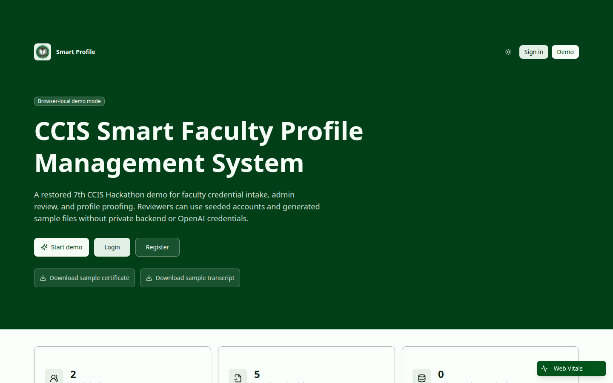
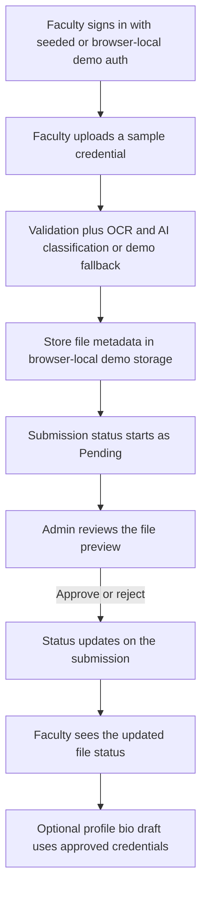

<div align="center">

# CCIS Smart Faculty Profile Management System

**A restored 7th CCIS Hackathon showcase for faculty credentials, admin review, and profile proofing — live in the browser, no backend required.**

[Live Demo](https://iron-mark.github.io/Hackathon-Smart-Profile-Management-System/) · [Public Demo Guide](docs/PUBLIC_DEMO.md) · [Release Status](docs/release-status.md)

[](https://iron-mark.github.io/Hackathon-Smart-Profile-Management-System/)
[](https://vitejs.dev/)
[](https://www.typescriptlang.org/)
[](https://tailwindcss.com/)
[](https://playwright.dev/)

</div>

<p align="center">
  
</p>
<p align="center"><em>The public landing page: branded CCIS green hero, seeded demo entry, and local Web Vitals in the lower right.</em></p>

---

## Try it in 60 seconds

Open the live GitHub Pages demo:

**https://iron-mark.github.io/Hackathon-Smart-Profile-Management-System/**

1. Select **Start demo** to prefill the faculty reviewer account.
2. Upload a generated sample credential from the faculty dashboard.
3. Sign in as admin, open **Approvals**, preview the file, and approve it.
4. Return as faculty and confirm the credential is approved.

Seeded accounts:

| Role | Email | Password |
| --- | --- | --- |
| Faculty | `faculty@umak.edu.ph` | `Faculty123` |
| Admin | `admin@umak.edu.ph` | `Admin123` |

Additional seeded faculty rows for admin-review data: `daniel.reyes@umak.edu.ph` and `liza.mercado@umak.edu.ph` (same faculty password).

This is a **browser-local public showcase**, not a production records system. Use the generated sample files only. Do not upload real IDs, transcripts, licenses, or private faculty documents.

---

## Product screens

Light and dark mode share one CCIS green token system. The landing hero stays a dark branded band in both themes so the first impression does not invert to bright lime.

<p align="center">
  
  
</p>
<p align="center"><em>Landing in light and dark. Theme toggle is in the public header.</em></p>

<p align="center">
  
</p>
<p align="center"><em>Login with seeded Faculty demo / Admin demo shortcuts. Web Vitals stays clickable below the demo access panel.</em></p>

<p align="center">
  
  
</p>
<p align="center"><em>Faculty workspace: smart upload, sample-file warning, and a light or deep-green sidebar.</em></p>

<p align="center">
  
</p>
<p align="center"><em>Faculty profile builder with document-assisted autofill and biography draft actions.</em></p>

<p align="center">
  
  
</p>
<p align="center"><em>Admin reviewer workspace and the approval queue that closes the faculty → admin loop.</em></p>

<p align="center">
  
</p>
<p align="center"><em>Local Core Web Vitals panel: live LCP, FCP, and TTFB for the current browser session. Metrics stay in the browser.</em></p>

Refresh these captures after UI changes:

```bash
npm run docs:screenshots
```

---

## Why this demo exists

The original 7th CCIS Hackathon entry showed a faculty credential workflow: upload, classify, review, approve, then turn approved records into a professional profile. This repository restores that product path as a **portfolio-ready public demo**.

Reviewers can click through a complete loop without private backend accounts, storage buckets, or OpenAI keys. Seeded data, generated sample files, and deterministic AI/OCR fallbacks keep the story honest and runnable from a clean clone or GitHub Pages.

What that means in practice:

- **Faculty intake** — validate sample files, classify the document type, and store a pending submission in this browser.
- **Admin review** — open a demo preview, approve or return the file, and leave an audit trail in local demo storage.
- **Profile proof** — edit professional details and draft a biography from approved credentials.
- **Readable CCIS theme** — light mint surfaces and a dark green-black chrome share one brand, with a public theme toggle.
- **Reviewer telemetry** — a lower-right Web Vitals control reports LCP, INP, CLS, FCP, and TTFB locally. It does not send analytics anywhere.

Public checkpoint: [`v2.1.1`](https://github.com/Iron-Mark/Hackathon-Smart-Profile-Management-System/releases/tag/v2.1.1). Current release notes live in [`docs/release-status.md`](docs/release-status.md).

Pull-request CI is read-only and receives no repository secrets. Owners, collaborators, Dependabot, and Imgbot can be readied and queued for squash auto-merge only after all required checks succeed; other forks stay manual. Workflow dependencies are pinned to full commit SHAs. See [`.github/CI_SECURITY.md`](.github/CI_SECURITY.md).

---

## Key capabilities

### Smart upload pipeline

Faculty users drop a sample credential on the dashboard. The demo checks type and size, classifies the document, stores the submission, and keeps the flow usable when OCR or OpenAI services are not configured.

### Role-based demo routing

Administrators and faculty users land in separate app areas. `ProtectedRoute` reads the signed-in role from browser-local demo state.

### Admin review dashboard

Admins review pending submissions, open the demo file preview, and approve or return uploads. Faculty users then see the updated status in Uploaded Files.

### Profile builder and bio drafting

The faculty profile screen supports editable professional details, document-assisted autofill, and a biography draft action based on approved credentials. In public demo mode this uses safe fallbacks unless a local API key is set.

### Light and dark brand theme

One CCIS green token system covers landing, auth, faculty, and admin chrome. Status chips use `success`, `warning`, and `info` tokens. The theme-color meta tag follows the active mode (`#f3faf4` light, `#102418` dark).

---

## Architecture

The restored project keeps the original React, Vite, OCR, and OpenAI-assisted product direction while making the public showcase reliable without private services. Seeded accounts, submissions, audit logs, and file metadata live in browser storage. Uploaded files stay demo-local and are not sent to a hosted document store.


```mermaid
graph TD
    A[Faculty signs in with seeded or browser-local demo auth] --> B[Faculty uploads a sample credential]
    B --> C[Validation plus OCR and AI classification or demo fallback]
    C --> D[Store file metadata in browser-local demo storage]
    D --> E[Submission status starts as Pending]
    E --> F[Admin reviews the file preview]
    F -->|Approve or reject| G[Status updates on the submission]
    G --> H[Faculty sees the updated file status]
    H --> I[Optional profile bio draft uses approved credentials]
```

### Demo-only backend

The app does not support a hosted backend setup path. `VITE_DEMO_MODE=true` remains in `.env.example` to make that intent explicit, but the browser-local demo backend is always used.

`VITE_OPENAI_API_KEY` is optional for local restoration. If it is missing, AI classification and biography generation use mock/demo fallbacks. Do not use a browser-exposed OpenAI key for production without a server-side proxy.

### Optional Clerk showcase auth

Clerk can be enabled for sign-in, sign-up, profile menu, and Organization switching by adding a publishable key to `.env.local`:

```env
VITE_CLERK_PUBLISHABLE_KEY=pk_test_or_pk_live_value_here
```

This does not add a production backend. Clerk-authenticated visitors map to a browser-local faculty demo account. Admin access remains the seeded admin demo account because browser-side Organization state is not a trusted authorization source.

- React quickstart: https://clerk.com/docs/react/getting-started/quickstart
- Organizations: https://clerk.com/docs/guides/organizations/overview
- Components: https://clerk.com/docs/reference/components/overview
- Dashboard: https://dashboard.clerk.com/

---

## Run locally

### Requirements

- Node.js 20 or newer
- npm 11 or newer

### Quick start

```bash
npm ci
cp .env.example .env.local   # Windows: copy .env.example .env.local
npm run dev
```

Open the local Vite URL, usually `http://localhost:5173`.

The landing page **Start demo** button opens login with seeded faculty credentials prefilled and links to generated sample files in `public/demo-samples`. Login and register also include **Reset demo data** for clearing stale browser-local state.

Public visitors can register with any valid email. Registration creates a local faculty account in that browser only. The sample set covers certificate, transcript, diploma, CV, and research summary records.

### Docker

The repository includes a multi-stage Dockerfile that builds the React project and serves the static output through NGINX.

```bash
docker build -t smart-profile-system .
docker run -p 80:80 smart-profile-system
```

---

## Verification

```bash
npm ci
npm test -- --run
npm run lint
npm run security:scan
npm run seo:check
npm run links:check
npm run build
npx playwright test
```

To verify the built output with the same base path used by GitHub Pages, use the commands in `docs/demo-checklist.md`. `npm run preview:pages` serves `dist` under the repository base path so local QA matches GitHub Pages asset URLs.

### Restoration notes

- `npm ci` works without `--legacy-peer-deps`.
- The production build creates `dist/404.html` through a cross-platform Node script.
- `npm run seo:check` validates the GitHub Pages canonical URL, crawler files, answer-engine FAQ data, social preview metadata, and 1200x630 Open Graph image.
- Route-level code splitting keeps the public demo entry lighter than the full dashboard bundle.
- `npm run security:scan` checks source files for common private key and token patterns.
- Local and GitHub Pages demo mode preserve the 7th CCIS Hackathon workflow without requiring private accounts.
- The demo backend is local-only and is not production authentication, production authorization, or production document storage.

---

## Documentation

| Doc | What it covers |
| --- | --- |
| [`docs/PUBLIC_DEMO.md`](docs/PUBLIC_DEMO.md) | Fast reviewer path, safety notes, post-deploy smoke checks |
| [`docs/demo-checklist.md`](docs/demo-checklist.md) | Showcase script, theme checks, screenshot refresh, Pages preview |
| [`docs/demo-backend.md`](docs/demo-backend.md) | Browser-local storage, reset behavior, optional Clerk/AI |
| [`docs/seo-readiness.md`](docs/seo-readiness.md) | Canonical URL, indexing policy, AEO/GEO sources |
| [`docs/clerk-showcase-auth.md`](docs/clerk-showcase-auth.md) | Optional Clerk identity, organizations, limitations |
| [`docs/release-status.md`](docs/release-status.md) | Verified public checkpoint and release gate |

---

## About the author

* **Sole maintainer:** Mark Siazon

## Past initial hackathon team (Team 2nd Choice)

* **Mark Siazon** – Lead Frontend Developer & UI/UX
* **Charles Nathaniel Togle** – Backend & Integration
* **Alexa San Jose** – Systems & Architecture

<div align="center">
  <strong>Maintained by Mark Siazon. Original 7th CCIS Hackathon entry by Team 2nd Choice.</strong>
</div>
